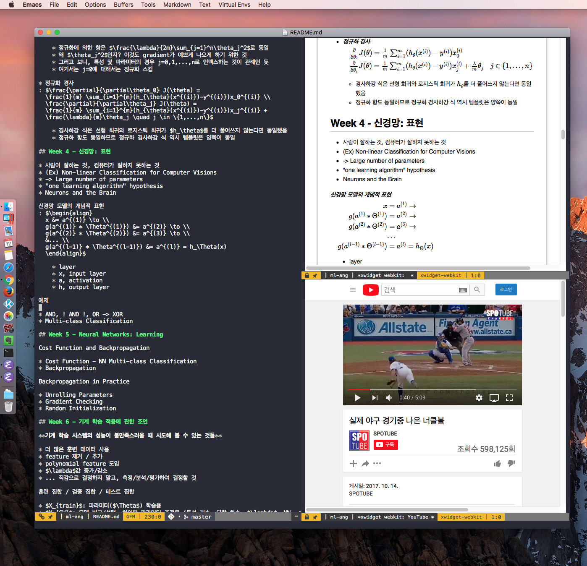

# nsxwidget - NS Cocoa backend for Emacs xwidgets

This repo supports Emacs feature xwidgets on native macOS X Cocoa.

Though original Emacs xwidgets builds and works on macOS but must
build and run with X window and GTK instead of macOS's own GUI
framework, resulting unaligned styles and UX with surrounding desktop
environment.

**WARNING** This software is *EXPERIMENTAL* and *UNSTABLE*, can causes
lost of data you are working on with this.

For example, while I develop, once watched an abrupt termination of
this program that is not resolved.

## Screenshot

Reviewing pandoc generated html in emacs xwidget webkit for mac os x,



## How to build

On quite recent macOS X system with Xcode and WebKit2

* Git clone this repo and checkout master
``` shell
git clone https://github.com/veshboo/emacs.git
git checkout master
```

* Notable dependencies
``` shell
brew install texinfo
brew install gnutls
```

* Environment variable for newly installed texinfo (makeinfo)
``` shell
export PATH=/usr/local/opt/texinfo/bin:$PATH
export LDFLAGS=-L/usr/local/opt/texinfo/lib
```

* then build Emacs
``` shell
./autogen.sh
./configure --prefix=$HOME/works/emacs-devel --with-xwidgets
make install
```

For general build information, read `INSTALL.REPO`.

## How to use

Your Emacs app built is located under `prefix`/nextstep/Emacs.app
... you can run it from command line

``` shell
cd $HOME/works/emacs-devel/emacs
./nextstep/Emacs.app/Contents/MacOS/Emacs
```

or by double-clicking Emacs app icon under `prefix`/nextstep folder in
Finder.

## Brief xwidget webkit commands and key mappings

* Commands

    * M-x xwidget-webkit-browse-url RET, enter a URL you want visit
      including "https://", "http://", "files:///" part

    * C-u M-x xwidget-webkit-browse-url RET, ... does same but using
      new session of webkit

* Key mappings (apply when keyboard focus is in Emacs buffer not
  webkit inside of it, click mode-line to be sure)

    * space, shift-space, up/down, left/right, delete: Scrolling

    * b, r: backward, reload

* Write elisp using `lisp/xwidget.el` to your task
